# Python-CI-CD-Azure-Pipelines

## Demonstrate Continuous Integration & Continuous Deployment using GitHub and Azure Services and perform a Load Test on the deployed application using Locust

### Repository consists of 3 Projects
1) [x] Project 1 - located in folder **/Hello_Python_App** demonstrates CI using GitHub Actions
2) [x] Project 2 - located in folder **/Flask_ML_Python_App-Azure_Pipelines** demonstrates CI and CD using Azure Pipelines
3) [x] Project 3 - located in folder **/Flask_ML_Pyhton_App-GitHub_Actions** demonstrates CI and CD using GitHub Actions

### Architectural Diagram
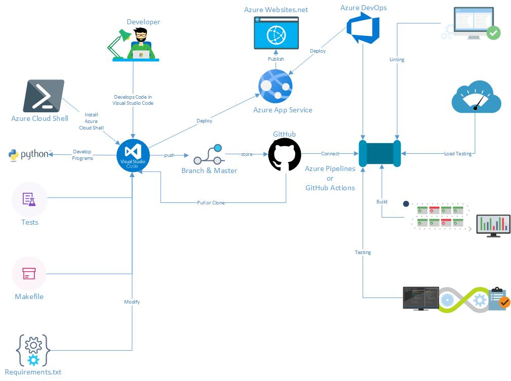

### Project Plan
[Yearly, Quarterly Project Plan for CI-CD Project](./project_plan/Q1-2021.xlsx)

### Trello Board
[Project's Trello Board](https://trello.com/b/KuYAsEet/project-2)

## Project 1
Demonstrate Continuous Integration with a Python App in folder **/Hello_Python_App**

### Clone the repository using GitBash
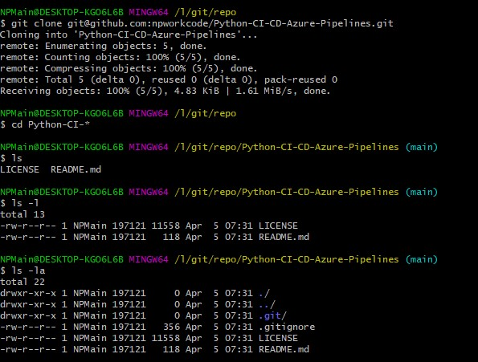

### Execute make all on local computer
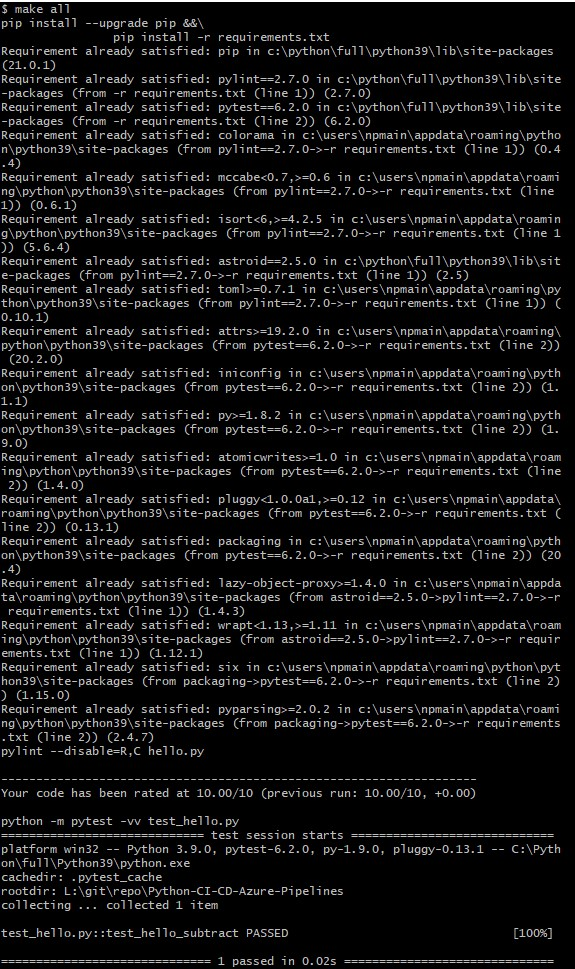

### GitHub Action Workflow for Project 1
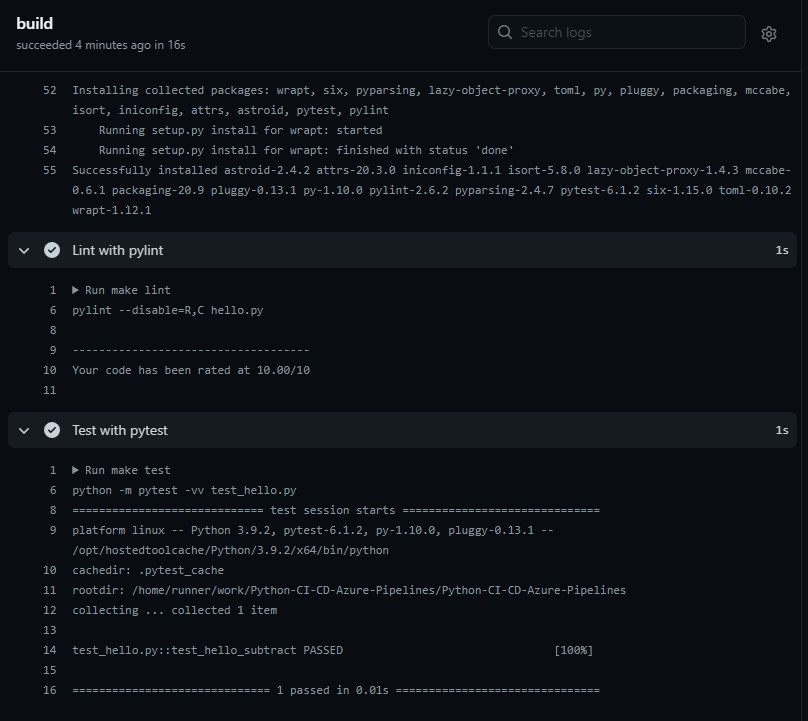

[](https://github.com/npworkcode/Python-CI-CD-Azure-Pipelines/actions/workflows/pythonapp.yml)

## Project 2

### Deploy the Python App to Azure App Service from Powershell
### Project located in folder **/Flask_ML_Python_App-Azure_Pipelines**
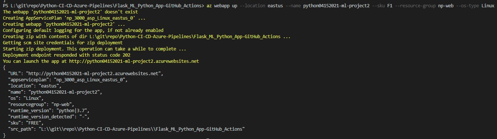

### Perform CI - CD with Azure Pipelines
- Approval from Microsoft to use Service agent for Azure Pipeline
> - https://devblogs.microsoft.com/devops/change-in-azure-pipelines-grant-for-private-projects/
> - https://devblogs.microsoft.com/devops/change-in-azure-pipelines-grant-for-public-projects/

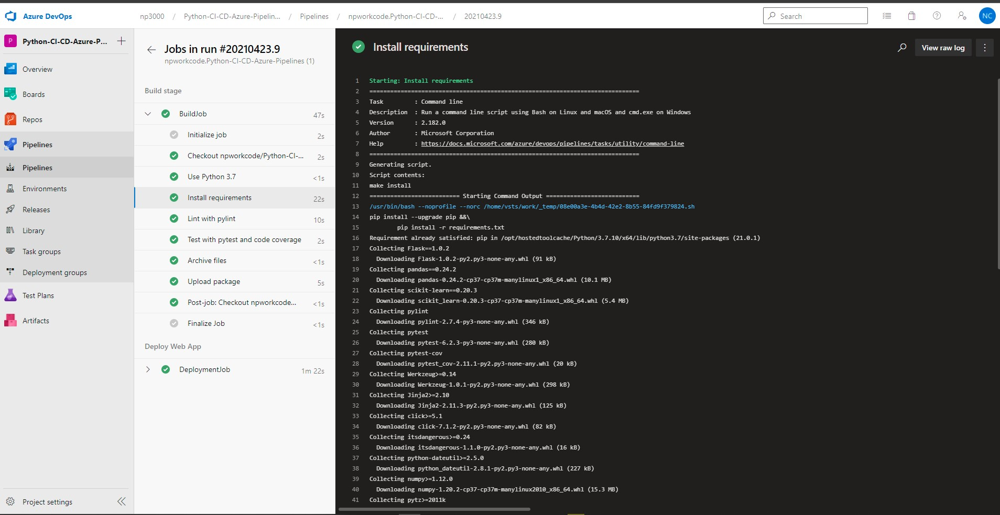

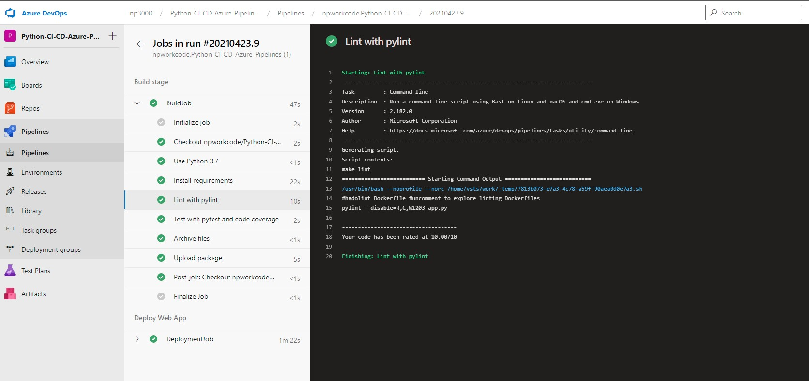

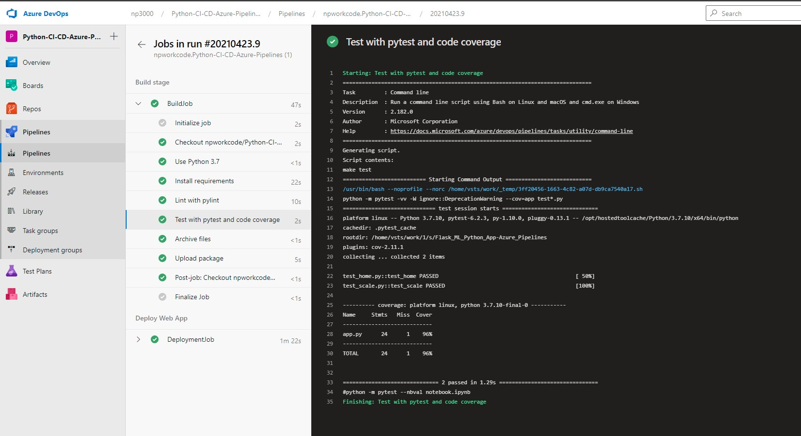

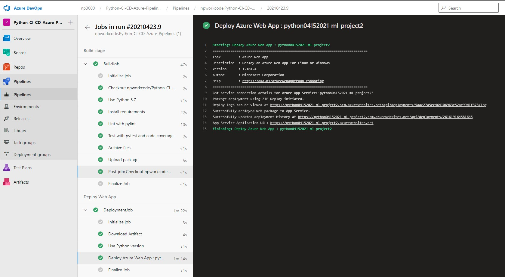

### Demo of Project CI - CD using Azure Pipelines
https://youtu.be/I9d_mYLev1g
## Project 3

### Located in folder **/Flask_ML_Python_App-GitHub_Actions**

### Generate an Azure Publish profile in Azure Cloud Services and Configure the GitHub Secret
https://docs.microsoft.com/en-us/azure/app-service/deploy-github-actions?tabs=applevel

### Successful deploy of Flask ML Python App to Azure App Service
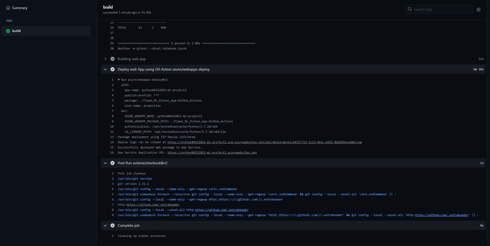

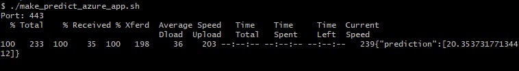

## Load Test Deployed App with Locust

### Setup Locust to run load test

### Move to directory with locust files **/locust**
```PowerShell
py -3 -m venv ~/.avenv
source ~/.avenv/scripts/activate
pip install locust
locust -f locusApp.py
```
### Open a Web browser to http://localhost:8089
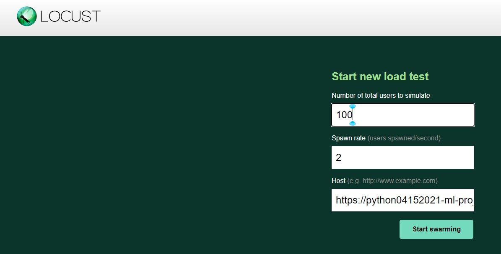

1) The number of users to simulate
2) The spawn rate (number of users created per second)
3) Enter the URL of the app https://python04152021-ml-project2.azurewebsites.net

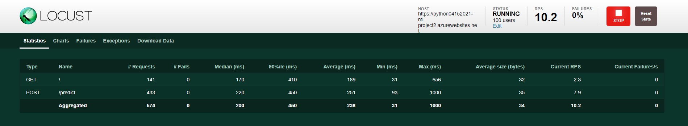

### Locust load testing report
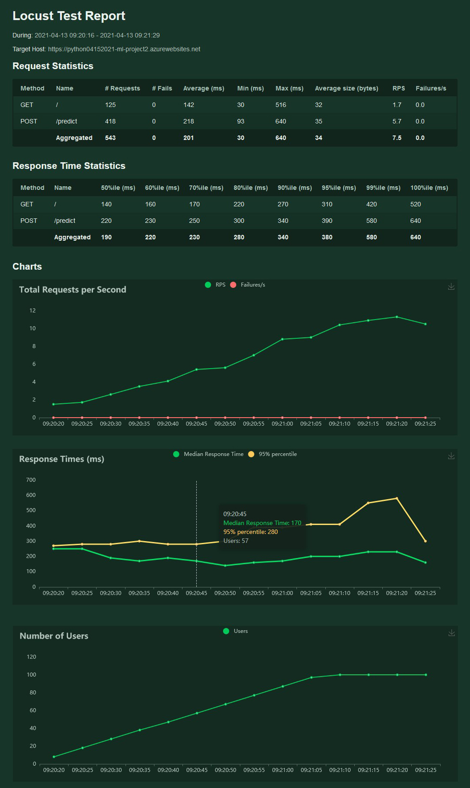
## Demo
https://www.youtube.com/watch?v=qB16kKV-M_E

## Future Enhancements
1) Deploy the app in a Docker Container and Automatically deploy to a Kubernetes Pod
2) Use different programming language to create the app


[](https://github.com/npworkcode/Python-CI-CD-Azure-Pipelines/actions/workflows/pythonapp.yml)
